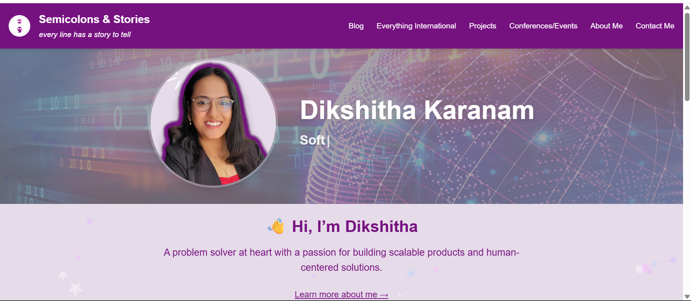

# 📝 Semicolons & Stories

**"Every line has a story to tell."**  
A full-stack, responsive personal portfolio built using **Next.js 14**, designed to showcase projects, blogs, achievements, and career trajectory in a thoughtful, developer-centric narrative.



---

## 🚀 Live Site

🔗 [https://semicolon-stories.vercel.app/](https://semicolon-stories.vercel.app/)

---

## ✨ Features

- 🌐 **Landing Page with Typewriter** showcasing key roles (SDE, TPM, FSD)
- 🔍 **Projects Dashboard** with tech stack tags and repo links
- 📝 **Blog Section** with long-form content support (HTML/MDX-ready)
- 🧭 **Navigation Bar** with mobile hamburger menu
- 📊 **"In a Nutshell" Highlights** — Achievements, Projects, Blogs, Awards
- 🧠 **Ikigai Section** to reflect personal philosophy
- 📩 **Contact Me Page** for networking and collaborations
- 🦄 **Responsive & Accessible** (mobile-optimized, semantic HTML)

---

## 🛠 Tech Stack

| Category       | Tools                                      |
|----------------|--------------------------------------------|
| Framework      | [Next.js 14](https://nextjs.org/)          |
| Styling        | Tailwind CSS                   |
| Icons          | FontAwesome, React-Icons                   |
| Fonts          | Geist Sans, Geist Mono                     |
| Hosting        | Vercel                                      |
| Forms          | Formspree     |
| Image Handling | Next.js `<Image />`                        |
| Particle Background| react-particles                        |
---

First, run the development server:

```bash

git clone https://github.com/kmdikshitha/portfolio.git

cd semicolons-and-stories

npm install

npm run dev

```
